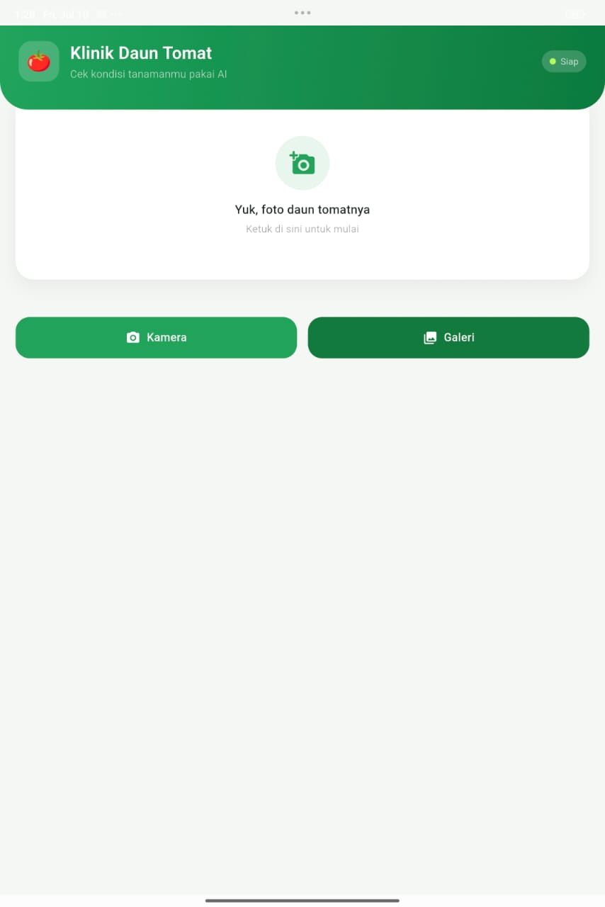
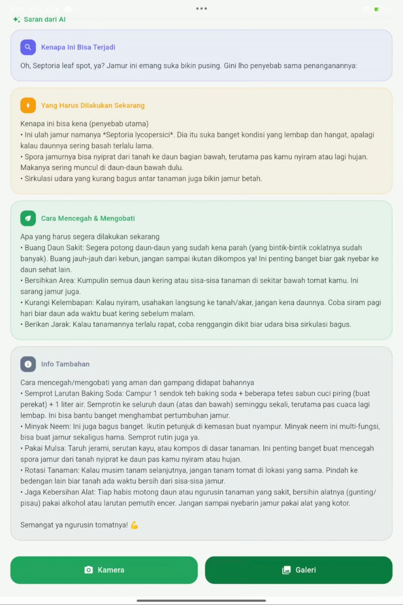

# 🍅 Klinik Daun Tomat

Aplikasi Flutter untuk mendeteksi penyakit pada daun tomat menggunakan **model AI on-device (TensorFlow Lite)**, dilengkapi saran penanganan yang dihasilkan oleh **Gemini API** dalam bahasa yang santai dan mudah dipahami.


---

## ✨ Fitur

- 📸 **Deteksi dari foto** — ambil foto langsung dari kamera atau pilih dari galeri
- 🧠 **AI on-device** — klasifikasi penyakit daun tomat berjalan lokal di HP (TensorFlow Lite), tidak butuh koneksi internet untuk tahap ini
- 💬 **Saran penanganan otomatis** — begitu penyakit terdeteksi, aplikasi bertanya ke Gemini API dan menampilkan saran dalam bentuk poin-poin yang mudah dibaca
- 🎨 **UI modern** — kartu hasil, badge status, progress bar keyakinan AI, dan bubble saran dengan ikon per poin

## 📱 Screenshot

> _Tambahkan screenshot aplikasi di sini setelah build pertama, misalnya:_
>
> ```markdown
> | Beranda                               | Hasil Deteksi                       | Saran AI                           |
> | ------------------------------------- | ----------------------------------- | ---------------------------------- |
> |  |  |  |
> ```

## 🛠️ Teknologi yang Digunakan

| Komponen           | Teknologi                              |
| ------------------ | -------------------------------------- |
| Framework          | Flutter                                |
| Bahasa             | Dart                                   |
| Model AI lokal     | TensorFlow Lite (`flutter_tflite`)     |
| AI saran teks      | Google Gemini API (`gemini-2.5-flash`) |
| Pengambilan gambar | `image_picker`                         |
| HTTP client        | `http`                                 |

## 📋 Prasyarat

Sebelum mulai, pastikan sudah terpasang:

- [Flutter SDK](https://docs.flutter.dev/get-started/install) (versi stabil terbaru)
- Android Studio / Xcode (tergantung target platform)
- Akun Google AI Studio untuk mendapatkan **API Key Gemini** → [aistudio.google.com/apikey](https://aistudio.google.com/apikey)

## 🚀 Instalasi & Menjalankan

```bash
# 1. Clone repo ini
git clone https://github.com/USERNAME/NAMA-REPO.git
cd NAMA-REPO

# 2. Install dependencies
flutter pub get

# 3. Siapkan API key Gemini (lihat bagian "Konfigurasi API Key Gemini" di bawah)
cp env.json.example env.json
# lalu edit env.json, isi dengan API key kamu

# 4. Jalankan di device/emulator yang terhubung
flutter run --dart-define-from-file=env.json
```

## 🔑 Konfigurasi API Key Gemini

Aplikasi ini butuh API Key dari Gemini untuk fitur saran penanganan. Karena repo ini **publik**, key **tidak ditulis langsung di kode** — dibaca dari file `env.json` yang tidak ikut ter-commit.

1. Ambil API key gratis di [aistudio.google.com/apikey](https://aistudio.google.com/apikey)
2. Copy `env.json.example` jadi `env.json`:
   ```bash
   cp env.json.example env.json
   ```
3. Buka `env.json`, ganti isinya dengan key kamu:
   ```json
   {
     "GEMINI_API_KEY": "AIzaSy...key_asli_kamu"
   }
   ```
4. Jalankan aplikasi dengan menyertakan file tersebut:
   ```bash
   flutter run --dart-define-from-file=env.json
   ```
   Kalau build APK release, caranya sama, tinggal ganti `run` jadi `build apk`:
   ```bash
   flutter build apk --dart-define-from-file=env.json
   ```

> ⚠️ `env.json` sudah masuk `.gitignore`, jadi aman — tapi tetap **jangan pernah** copy-paste isi key ke tempat lain yang publik (issue GitHub, screenshot, grup chat, dst).

> 🔒 **Catatan lebih lanjut soal keamanan:** cara ini mencegah key bocor lewat _source code_ di repo. Tapi karena aplikasi tetap jalan di HP user, key ini masih bisa diekstrak orang yang niat membongkar file APK (reverse engineering). Untuk aplikasi yang benar-benar dirilis ke publik luas, cara paling aman adalah memindahkan pemanggilan Gemini API ke backend/Cloud Function milikmu sendiri — jadi HP user hanya bicara ke backend-mu, dan API key Gemini disimpan di server, tidak pernah ikut terkirim ke device.

## 📂 Struktur Project

```
lib/
└── main.dart          # Seluruh logic & UI aplikasi (entry point)
assets/
├── model_tomat.tflite # Model TensorFlow Lite untuk klasifikasi penyakit
└── labels.txt         # Daftar label/kelas penyakit yang dikenali model
```

## 🧠 Cara Kerja

1. User mengambil/memilih foto daun tomat
2. Model TFLite (`assets/model_tomat.tflite`) memproses gambar **secara lokal di device** dan mengembalikan label + tingkat keyakinan
3. Jika hasilnya bukan "sehat" dan keyakinannya cukup tinggi (≥ 55%), aplikasi mengirim nama penyakit ke **Gemini API**
4. Gemini membalas saran penanganan dalam 3 poin (penyebab, tindakan segera, pencegahan/pengobatan)
5. Jawaban tersebut otomatis dipecah jadi beberapa _bubble_ kartu dengan ikon berbeda untuk kemudahan membaca

## 🤝 Kontribusi

Kontribusi terbuka untuk siapa saja!

1. Fork repo ini
2. Buat branch baru: `git checkout -b fitur/nama-fitur`
3. Commit perubahan: `git commit -m "Menambahkan fitur X"`
4. Push ke branch: `git push origin fitur/nama-fitur`
5. Buat Pull Request

## 📄 Lisensi

Project ini menggunakan lisensi [MIT](LICENSE) — bebas digunakan, dimodifikasi, dan didistribusikan ulang.
